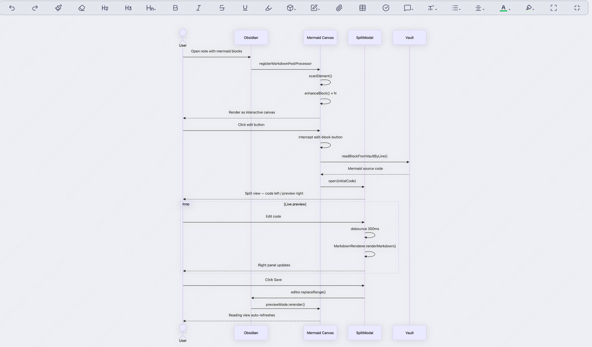
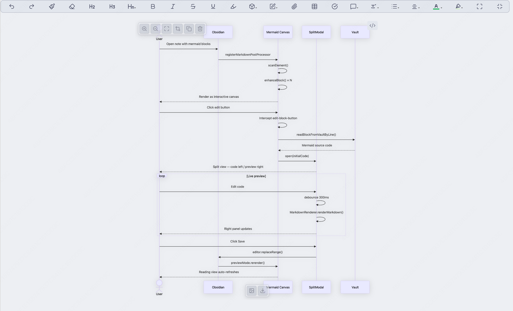
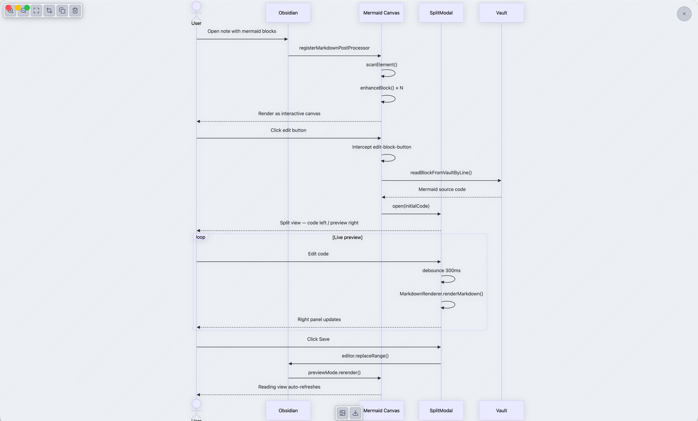
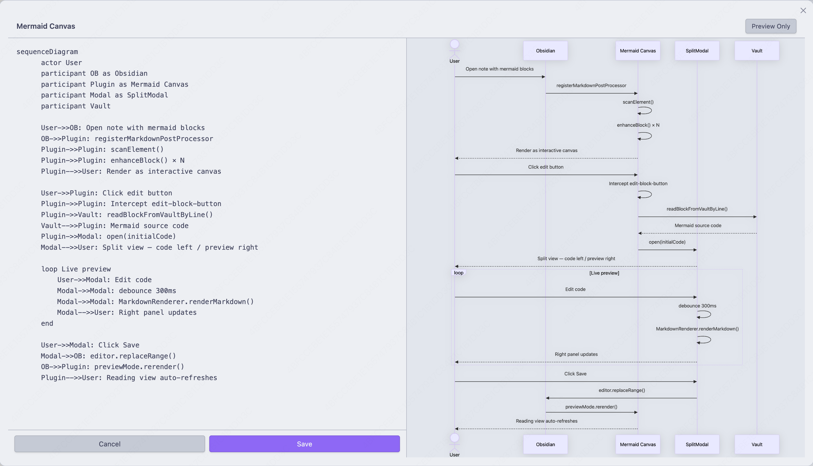
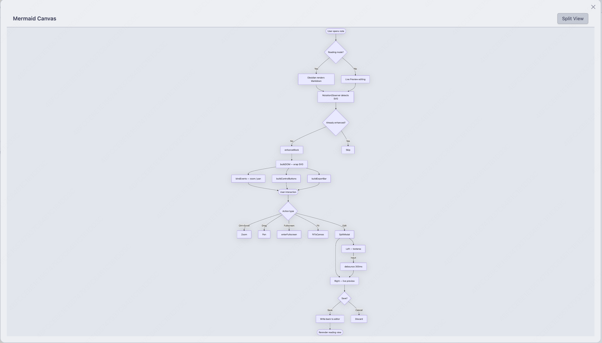

# Mermaid Canvas

An Obsidian plugin that turns every `mermaid` code block into an interactive canvas — zoom, pan, fullscreen, copy, export, and a built-in split editor. No more squinting at cramped diagrams.

## Preview

**Inline canvas — clean view**



**Hover to reveal controls**



**Fullscreen mode**



**Split editor — code left, live preview right**





## Features

- **Adaptive canvas** — SVG renders at natural size, fills available width, no hardcoded constraints
- **Smooth zoom & pan** — `Ctrl/Cmd` + scroll wheel to zoom toward cursor, drag to pan
- **Control bar** — hover to reveal Zoom In / Zoom Out / Fullscreen / Fit / Copy / Delete
- **Export bar** — hover bottom-center to export as PNG or SVG
- **Fullscreen mode** — expand any diagram to fill the viewport, Esc to exit
- **Fit to canvas** — one click to auto-scale the diagram to fit the available space
- **Copy code** — copy the raw mermaid source to clipboard
- **Export PNG / SVG** — download the diagram directly from the canvas
- **Delete block** — remove the entire code block with one click
- **Split editor** — `/mermaid` command inserts a block and opens a live split-view editor
- **Edit interception** — click Obsidian's native edit button to open the split editor pre-loaded with the correct code
- **Auto-refresh** — saving in the split editor immediately updates the reading view
- **Error resilience** — invalid or empty blocks are gracefully skipped

## Usage

| Action | How |
|--------|-----|
| Insert + edit | `/mermaid` slash command in the editor |
| Edit existing | Click the ✏️ edit button on any rendered mermaid block |
| Zoom | `Ctrl/Cmd` + scroll wheel (or two-finger pinch on trackpad) |
| Pan | Click and drag the diagram |
| Fullscreen | Hover → click Maximize button, Esc to exit |
| Fit to canvas | Hover → click Fit button |
| Copy code | Hover → click Copy button |
| Export PNG | Hover bottom-center → click Image button |
| Export SVG | Hover bottom-center → click Download button |
| Delete block | Hover → click Trash button |

## Installation

### Manual

1. Download the latest `main.js`, `styles.css`, and `manifest.json` from [Releases](https://github.com/cheney12138/mermaid-canvas-plugin/releases)
2. Copy them into `your-vault/.obsidian/plugins/mermaid-canvas/`
3. Reload Obsidian and enable the plugin in Settings → Community Plugins

### From Source

```bash
git clone https://github.com/cheney12138/mermaid-canvas-plugin.git
cd mermaid-canvas-plugin
npm install
npm run build
# Then copy main.js, styles.css, manifest.json to your vault's plugins folder
```

## Settings

- **Zoom sensitivity** (1–10) — how fast the scroll wheel zooms
- **Default split view** — open the code editor alongside the preview by default

## License

MIT
